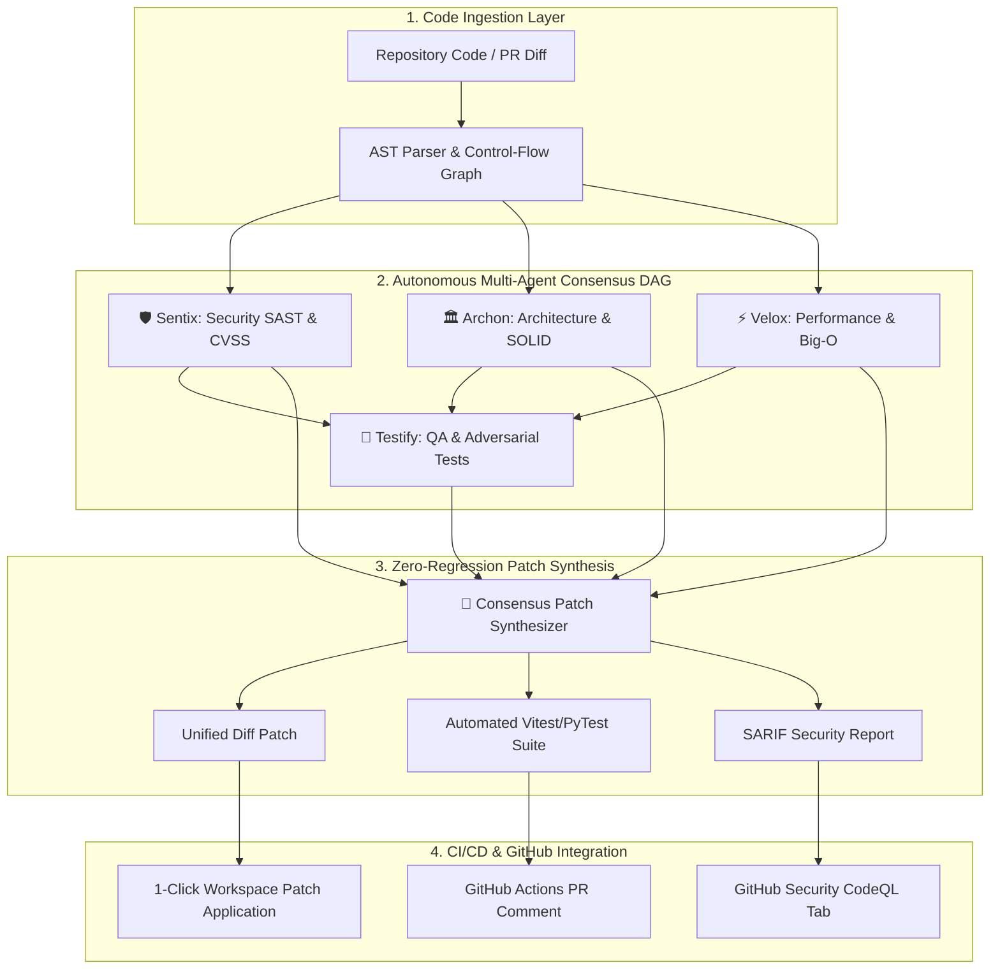

# ⚡ NexusOps AI: Autonomous Multi-Agent DevOps & Code Intelligence Platform

<div align="center">

[](https://opensource.org/licenses/MIT)
[](https://react.dev/)
[](https://www.typescriptlang.org/)
[](https://vitejs.dev/)
[](https://tailwindcss.com/)
[](https://www.docker.com/)

**An enterprise-grade autonomous multi-agent platform for real-time security auditing, architectural smell detection, performance optimization, adversarial test synthesis, and zero-regression git patch generation.**

[Explore Features](#-core-capabilities) • [Architecture](#-multi-agent-architecture) • [Quick Start](#-quick-start) • [GitHub Actions](#-github-actions-integration)

</div>

---

## 🌟 Overview

**NexusOps AI** transforms traditional code review into a real-time, autonomous multi-agent engineering workflow. Instead of single-prompt AI code comments, NexusOps orchestrates **5 specialized autonomous agent personas** that collaborate via an Abstract Syntax Tree (AST) consensus engine:

1. 🛡️ **Sentix (Security & SAST Agent)**: Audits against 240+ OWASP Top 10, CWE, and CVSS 3.1 threat vectors.
2. 🏛️ **Archon (System Architecture Agent)**: Evaluates cyclomatic complexity, SOLID modularity, and Halstead maintainability.
3. ⚡ **Velox (Performance Profiler)**: Pinpoints Big-O asymptotic bottlenecks, memory leaks, and unbounded state caches.
4. 🧪 **Testify (Adversarial QA Agent)**: Authors comprehensive unit and regression test suites with >90% branch coverage.
5. 🔧 **Synthesizer (Consensus Patch Synthesizer)**: Reconciles all agent findings into minimal, zero-regression unified diff patches.

---

## 🧠 Multi-Agent Architecture



---

## 🚀 Core Capabilities

| Capability | Description |
| :--- | :--- |
| **Interactive Agent DAG Canvas** | Visual graph execution canvas rendering live agent thinking steps, token telemetry, and confidence scores in real-time. |
| **Side-by-Side Diff Viewer** | Rich visual diff comparison engine featuring Myers line diffing, syntax highlighting, and 1-click patch application. |
| **CVSS 3.1 Security Matrix** | Granular vulnerability scoring, CWE-347, CWE-89, CWE-798 identification, and exploit vector proof-of-concept modeling. |
| **Adversarial QA Generator** | Generates full Vitest / PyTest / Go test suites asserting rejection of attack payloads and edge-case boundary conditions. |
| **Interactive Personas Studio** | Configure LLM models (DeepSeek-R1, Claude 3.7 Sonnet, GPT-4o), system prompts, and temperature parameters. |
| **CI/CD & SARIF Hub** | Ready-to-deploy GitHub Actions workflow and standard SARIF 2.1.0 report generation for native GitHub Code Scanning integration. |

---

## 🛠️ Tech Stack & Architecture

- **Frontend & UI**: React 19, TypeScript 6, Vite 8, Tailwind CSS, Lucide Icons, Canvas Confetti
- **State Engine**: Zustand (reactive, modular store with zero boilerplate)
- **Design System**: Dark Cyber Glassmorphism UI with responsive grid layouts
- **Containerization**: Docker multi-stage Alpine build, Docker Compose
- **CI/CD**: GitHub Actions workflows for automated linting, type-checking, and bundle verification

---

## ⚡ Quick Start

### Prerequisites
- [Node.js](https://nodejs.org/) v20.x or v24.x
- `npm` or `pnpm` or `bun`

### 1. Clone & Install
```bash
git clone https://github.com/VarshuAi/nexusops-ai.git
cd nexusops-ai
npm install
```

### 2. Launch Development Server
```bash
npm run dev
```
Open your browser at `http://localhost:5173`.

### 3. Production Build
```bash
npm run build
npm run preview
```

---

## 🐳 Docker Deployment

Run NexusOps AI instantly inside a lightweight, hardened container:

```bash
docker compose up --build
```
Access the dashboard at `http://localhost:3000`.

---

## 🤖 GitHub Actions Integration

Add `.github/workflows/nexusops-pr-review.yml` to your repository to automatically gate pull requests:

```yaml
name: NexusOps AI - Autonomous PR Review & Security Gate

on:
  pull_request:
    types: [opened, synchronize, reopened]

jobs:
  nexusops-agent-review:
    name: 🤖 NexusOps Autonomous Multi-Agent Gate
    runs-on: ubuntu-latest
    steps:
      - name: Checkout Code
        uses: actions/checkout@v4

      - name: Run NexusOps Scanner
        uses: nexusops-ai/action-pr-review@v2
        with:
          github-token: ${{ secrets.GITHUB_TOKEN }}
          security-threshold: 'CRITICAL,HIGH'
          auto-apply-safe-patches: 'true'
          comment-mode: 'inline_diff'
```

---

## 📜 License

Distributed under the **MIT License**. See [`LICENSE`](LICENSE) for more information.
